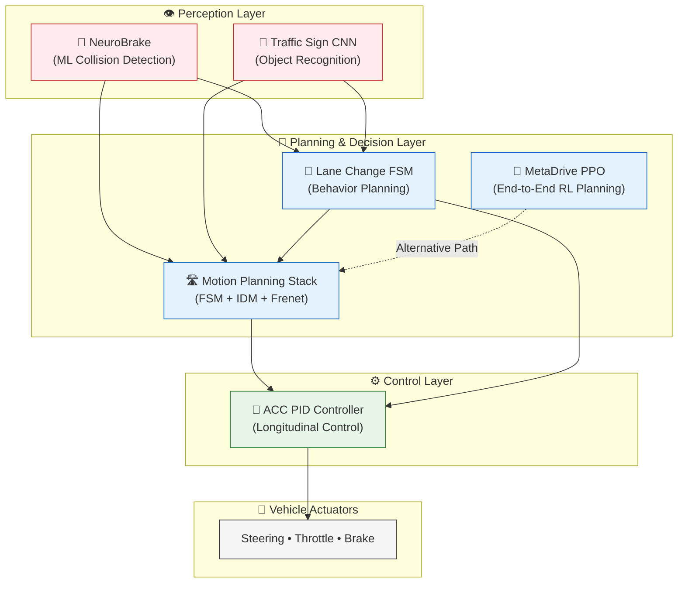
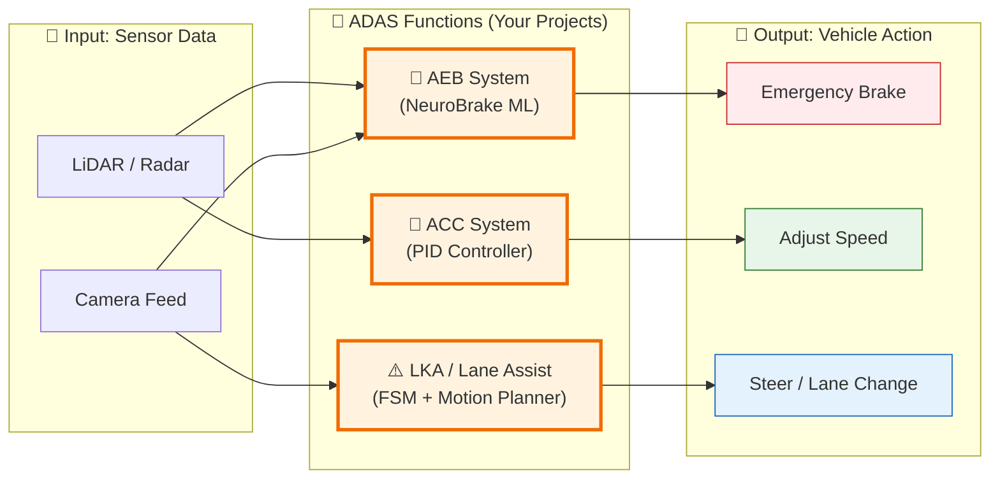

# 🚗 Autonomous Driving Engineering Portfolio

**Complete Full-Stack AV Portfolio: 6 End-to-End Projects covering Perception, Planning, Control, and Deep Learning.**

> 🇩🇪 **Based in Germany** | Open to ADAS, Motion Planning, and Autonomous Driving Engineering roles.  
> 🎓 **Masters in Automotive Engineering** | All projects open-source with production-ready code.

[📄 Download PDF Portfolio](assets/Vijay_ADAS_AV_Portfolio.pdf.pdf) • [📧 Contact](vijaypriyanayyaru@gmail.com) • [🔗 LinkedIn](https://www.linkedin.com/in/vijay-priyan-ayyaru/)

---

## 📊 Portfolio Overview

I've built **6 complete autonomous driving systems**, each tackling a different layer of the AV stack. This demonstrates **breadth** across all domains and **depth** in multiple specializations.

| # | Project | Domain | Key Achievement | Tech Stack |
|---|---------|--------|-----------------|------------|
| 1 | [**NeuroBrake (ML-AEB)**](#1-neurobrake-ml-based-automatic-emergency-braking) | Safety / Perception | Neural net for collision prediction | PyTorch, Sensor Fusion |
| 2 | [**Adaptive Cruise Control (PID)**](#2-adaptive-cruise-control---pid-controller) | Control Systems | Smooth distance keeping | PID, Control Theory |
| 3 | [**Highway Lane Change (FSM)**](#3-highway-lane-change---finite-state-machine) | Behavior Planning | Traffic-aware lane decisions | FSM, TTC Metrics |
| 4 | [**Highway Motion Planning Stack**](#4-highway-motion-planning-stack) | Motion Planning | FSM + IDM + Frenet Lattice | A*, Quintic Polynomials, SAT |
| 5 | [**MetaDrive PPO Planner**](#5-metadrive-ppo-highway-planner---deep-rl) | Deep RL | 87% reward on unseen scenarios | PPO, Gymnasium, MetaDrive |
| 6 | [**Traffic Sign Classifier (CNN+CLIP)**](#6-traffic-sign-classifier---cnn--clip) | Computer Vision | 93.4% accuracy on GTSRB | CNN, CLIP, Gradio |

---

## 🎯 Skills Matrix

This portfolio demonstrates competence across the **full autonomous driving stack**:

- Perception ████████████████████ (NeuroBrake, Traffic Signs)
- Planning ████████████████████ (FSM, Motion Planning, PPO)
- Control ███████████████░░░░░ (PID, IDM)
- Deep Learning ██████████████████░░ (CNN, PPO, CLIP)
- Safety Systems ████████████████████ (AEB, Collision Avoidance)


### **Technical Skills**

| Category | Technologies |
|----------|-------------|
| **Languages** | Python (Expert), C++ (Intermediate), MATLAB/Simulink |
| **Deep Learning** | PyTorch, torchvision, Transformers (CLIP), Stable-Baselines3 |
| **Computer Vision** | OpenCV, CNNs, Data Augmentation, GTSRB |
| **Planning** | A*, D*, Frenet Lattice, Quintic Polynomials, RRT* |
| **Control** | PID, MPC (learning), IDM, Stanley Controller |
| **Simulation** | MetaDrive, CARLA, LGSVL, ROS2 (learning) |
| **Tools** | Git, Docker, Jupyter, Gradio, TensorBoard, Linux/WSL |

---

### AD focused Stack:



## ADAS Focus Stack:



## 📁 Project Details

### 1. **NeuroBrake: ML-Based Automatic Emergency Braking**
**Domain:** Safety-Critical Perception  
**Goal:** Predict collisions and trigger emergency braking using sensor fusion.

**Key Features:**
- Neural network trained on simulated LiDAR + Radar data
- Binary classification (Brake/No-Brake) with <50ms inference latency
- Optimized for **zero false negatives** (safety-first design)
- Tested on edge cases (pedestrians, cyclists, stationary obstacles)

**Tech Stack:** PyTorch, Scikit-learn, Sensor Fusion  
**🔗 Repository:** https://github.com/VPA2998/neurobrake-ml-aeb

---

### 2. **Adaptive Cruise Control - PID Controller**
**Domain:** Longitudinal Control  
**Goal:** Maintain safe distance to lead vehicle with smooth acceleration.

**Key Features:**
- Classical **PID control** for throttle/brake commands
- Gain tuning for comfort (low jerk) and safety (fast response)
- Simulated lead vehicle with varying speed profiles
- Performance metrics: settling time, overshoot, steady-state error

**Tech Stack:** Python, Control Theory, Matplotlib  
**🔗 Repository:** https://github.com/VPA2998/adaptive-cruise-control-PID

---

### 3. **Highway Lane Change - Finite State Machine**
**Domain:** Behavior Planning  
**Goal:** Safe lane change decisions in highway traffic.

**Key Features:**
- **5-state FSM:** Cruise, Follow, Lane-Change-Left, Lane-Change-Right, Stop
- Gap assessment using **Time-to-Collision (TTC)** metrics
- Hysteresis to prevent oscillating decisions
- Traffic-aware state transitions

**Tech Stack:** Python, FSM, TTC Metrics  
**🔗 Repository:** https://github.com/VPA2998/highway-lane-change-behavior-planner-FSM

---

### 4. **Highway Motion Planning Stack**
**Domain:** Integrated Motion Planning  
**Goal:** Complete highway driving with planning, control, and collision avoidance.

**Key Features:**
- **FSM** for high-level behavior (Cruise, Follow, Stop, Lane-Change)
- **IDM** (Intelligent Driver Model) for car-following
- **Frenet Lattice** planner for smooth lateral trajectories (quintic polynomials)
- **Lanelet A*** for global routing on highway maps
- **SAT (Separating Axis Theorem)** for precise oriented-rectangle collision detection
- Modular `src/` architecture with 7 packages
- Demo GIF generation + Gradio interactive app
- Complete architecture documentation with Mermaid diagrams

**Tech Stack:** Python, NetworkX, Matplotlib, Gradio  
**🔗 Repository:** https://github.com/VPA2998/highway-motion-planning-stack  
**📐 Architecture Docs:** [View in repo](https://github.com/VPA2998/highway-motion-planning-stack/blob/main/docs/ARCHITECTURE.md)

---

### 5. **MetaDrive PPO Highway Planner - Deep RL**
**Domain:** End-to-End Reinforcement Learning  
**Goal:** Learn highway driving without explicit rules.

**Key Features:**
- Trained **PPO (Proximal Policy Optimization)** agent in MetaDrive simulator
- Observation: LiDAR + lane detectors (261-dim vector)
- Action: Continuous steering + throttle/brake (2-dim)
- **100k timesteps** training, evaluated on **unseen seeds (1000+)**
- **Results:**
  - Mean Reward: **87.2 ± 30.8** (unseen scenarios)
  - **7x better** than random baseline
  - Generalization gap: <13%
- Modular training pipeline with benchmark comparisons
- 9 demo GIFs (3 seeds × 3 traffic densities)

**Tech Stack:** PyTorch, Stable-Baselines3, MetaDrive, Gymnasium  
**🔗 Repository:** https://github.com/VPA2998/meta-drive-ppo-highway-planner  
**📊 Benchmark Results:** [View in repo](https://github.com/VPA2998/meta-drive-ppo-highway-planner#-benchmark-comparison)

---

### 6. **Traffic Sign Classifier - CNN + CLIP**
**Domain:** Computer Vision / Perception  
**Goal:** Recognize 43 traffic sign classes robustly under real-world corruptions.

**Key Features:**
- Custom CNN architecture (2 Conv + 2 FC layers, ~549K params)
- **93.4% test accuracy** on GTSRB dataset
- Robustness tested on **7 corruption types**: contrast, noise, blur, JPEG, pixelation, spatter
- **CLIP integration** for human-readable explanations (not classification)
- Interactive **Gradio demo** for real-time inference
- Professional **Model Card** with intended use, metrics, and ethical considerations
- Architecture diagrams with Mermaid

**Tech Stack:** PyTorch, torchvision, Transformers (CLIP), Gradio, GTSRB  
**🔗 Repository:** https://github.com/VPA2998/traffic-sign-classifier-cnn  
**📄 Model Card:** [View in repo](https://github.com/VPA2998/traffic-sign-classifier-cnn/blob/main/docs/MODEL_CARD.md)

---

## 🎓 What This Portfolio Demonstrates

### ✅ Breadth Across the AV Stack
- **Perception:** Neural networks (AEB), CNNs (Traffic Signs)
- **Planning:** FSM, A*, Frenet Lattice, PPO
- **Control:** PID, IDM
- **Learning:** Deep RL (PPO), CNNs, Transformers (CLIP)
- **Safety:** Collision avoidance, robustness testing, Model Cards

### ✅ Multiple Paradigms
- **Classical/Rule-Based:** PID, FSM, A* (Projects 2, 3, 4)
- **Learning-Based:** CNN, PPO (Projects 5, 6)
- **Hybrid:** NeuroBrake, Motion Planning Stack (Projects 1, 4)

### ✅ Production Mindset
Every project includes:
- 📦 **Modular architecture** (`src/` packages, not just notebooks)
- 📄 **Professional documentation** (README, Architecture docs, Model Cards)
- 🎬 **Interactive demos** (Gradio apps, GIFs, videos)
- 🧪 **Testing & Metrics** (accuracy, reward, generalization gap)
- ⚠️ **Ethical considerations** (Model Cards, safety notes)

### ✅ Masters-Level Rigor
- Trained on real datasets (GTSRB, MetaDrive scenarios)
- Evaluated on **unseen test conditions** (not just training distribution)
- Benchmark comparisons (vs. random baseline, vs. classical methods)
- Architecture diagrams and ablation studies

---

## 🚀 Quick Start: Run Any Project

All projects follow a similar setup pattern:

```bash
# 1. Clone any repository
git clone https://github.com/VPA2998/<project-name>.git
cd <project-name>

# 2. Create virtual environment
python3 -m venv .venv
source .venv/bin/activate  # On WSL/Linux

# 3. Install dependencies
pip install -r requirements.txt

# 4. Run the notebook or demo
jupyter notebook
# OR
python src/main.py  # If available
```

**Each repository includes:**

- Detailed `README.md` with quick start guide

- `requirements.txt` for dependency management

- `Jupyter notebook` with full pipeline

- `Modular src/ packages` (for production-ready code)


### 📄 PDF Portfolio
For a downloadable version with detailed project pages, metrics, and visuals:

📥 [Download PDF Portfolio] (assets/Vijay_ADAS_AV_Portfolio.pdf.pdf)

The PDF includes:

- Cover page with contact info

- Skills matrix and summary

- One page per project (problem, solution, metrics, images)

---

### 📧 Contact
Let's connect to discuss opportunities, collaborations, or technical details!

- `LinkedIn`: [Vijay Priyan Ayyaru](https://www.linkedin.com/in/vijay-priyan-ayyaru/)

- `Email`: vijaypriyanayyaru@gmail.com

- `GitHub`: https://github.com/VPA2998

- `Location`: Kempten (Allgäu), Germany

### 🙏 Acknowledgments


Special thanks to the open-source community for amazing tools:

- **MetaDrive** for scalable highway simulation

- **Hugging Face** for datasets and Transformers

- **CARLA** for urban driving simulation

- **Stable-Baselines3** for RL implementations

- **Gradio** for interactive demos
---

> *Built with ☕, Python, and a lot of debugging. All code is open-source and available for learning/collaboration.*

